title: Installing
permalink: /installing/
---

# Installing

This guide covers getting Melodee running quickly using containers, plus optional native dev setup.

## Option 1: Container Deployment (Recommended)

### Prerequisites

- Docker or Podman (with podman‑compose if using Podman)
- At least 2GB RAM (4GB recommended for large scans)
- Persistent storage volumes or bound host directories

### 1. Clone & Configure

```bash
git clone https://github.com/sphildreth/melodee.git
cd melodee
cp example.env .env
```

Edit `.env` values:

```bash
DB_PASSWORD=change_me
MELODEE_PORT=8080
```

Additional optional env vars will be documented soon (streaming tweaks, concurrency limits, etc.).

### 2. Launch

```bash
# Podman
podman-compose up -d

# Or Docker
docker compose up -d
```

Access: http://localhost:8080 — create the first user (becomes admin).

### 3. Provide Music Directories

The compose file defines volumes for:

- inbound: Drop new raw media here.
- staging: Holds processed media awaiting approval.
- storage: Canonical library (served to clients).

Mount or copy your music appropriately. The job engine will pick up changes on schedule (or trigger a scan manually in the UI / CLI).

### 4. Upgrading

```bash
podman-compose pull
git pull origin main
podman-compose up -d --build
```

Database migrations run automatically on startup.

## Option 2: Local Development (Source)

Prerequisites: .NET 9 SDK, PostgreSQL 17 (or use the compose DB service), ffmpeg in PATH (for transcoding), optional: imagemagick.

```bash
dotnet restore
dotnet run --project src/Melodee.Blazor
```

For CLI utilities:

```bash
dotnet run --project src/Melodee.Cli -- --help
```

## Initial Configuration Steps

1. Add or verify library paths in the configuration section of the UI.
2. Configure metadata providers (supply API keys where required).
3. Kick off an initial full scan (Jobs panel) to index existing media.
4. Review staging items, edit metadata/artwork, promote to storage.
5. Connect clients (OpenSubsonic URL usually: http://host:port). Use your username + password / token.

### Data path (simplified):

```mermaid
flowchart LR
	A[Inbound Files &#40;Raw Media&#41;] --> B[Ingestion / Conversion Normalization & Validation]
	B --> C[Staging Manual Edits & Artwork]
	C --> D[Storage Libraries Canonical Media]
	D --> E[Indexed DB Metadata Search & Stats]
	E --> F[APIs / Streaming OpenSubsonic + Native REST]

	%% Style definitions &#40;single class applied to all for now&#41;
	classDef proc fill:#4e79a7,stroke:#1f3349,color:#fff;
	class A,B,C,D,E,F proc
```



## Backups

Primary data to retain:

- PostgreSQL volume (melodee_db_data)
- Media volumes (storage + artwork)
- User images & playlists volumes

Example (Podman):

```bash
podman volume export melodee_db_data > db_backup_$(date +%F).tar
podman volume export melodee_storage > storage_backup_$(date +%F).tar
```

## Troubleshooting

| Symptom | Suggestion |
|---------|------------|
| High CPU during first run | Normal while initial scan & metadata enrichment proceeds. | 
| Streams 429 Too Many Requests | Reduce concurrent streams or adjust limiter settings (coming soon to config). |
| Client fails auth | Verify first user created; rotate API key if compromised. |
| Missing artwork | Ensure metadata jobs ran; trigger artwork refresh job. |

## Next Steps

- Read: /configuration/ for deeper tuning.
- Explore: /api/ for custom integrations.
- Contribute: /about/ for roadmap & community links.

